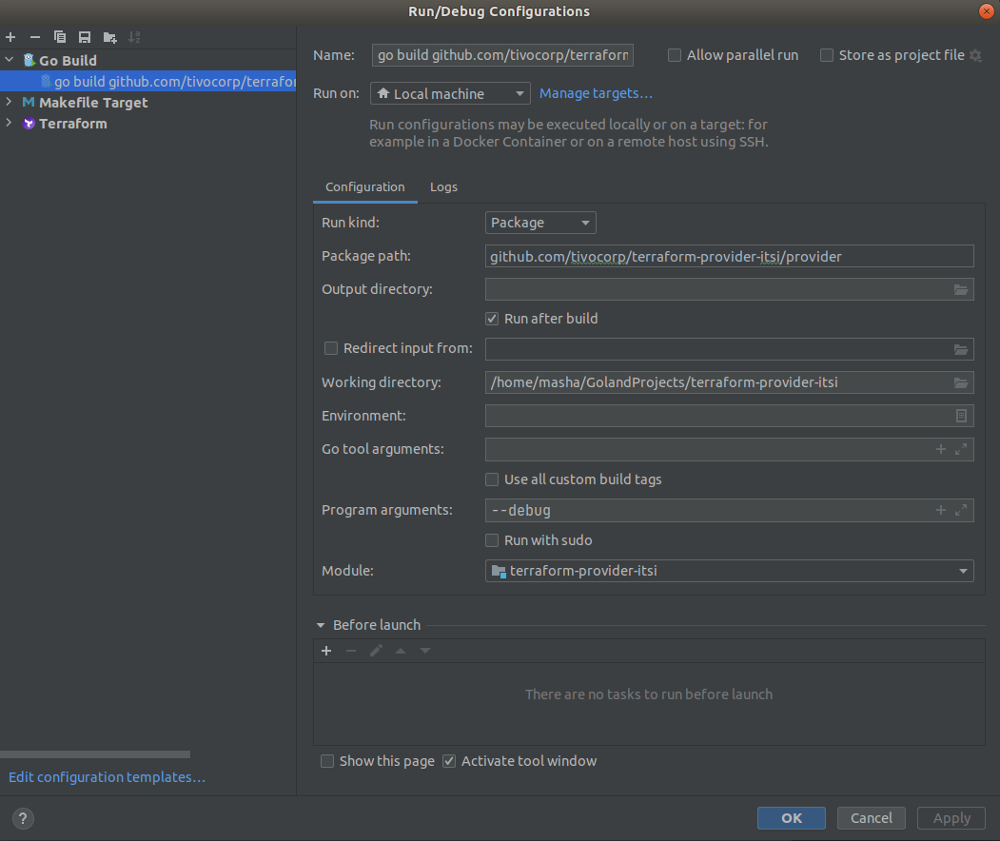
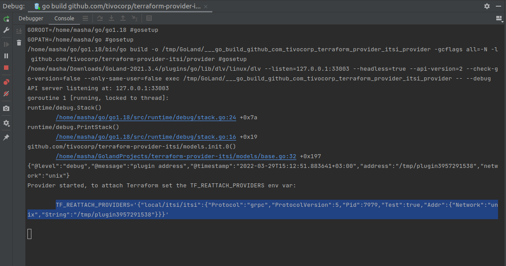
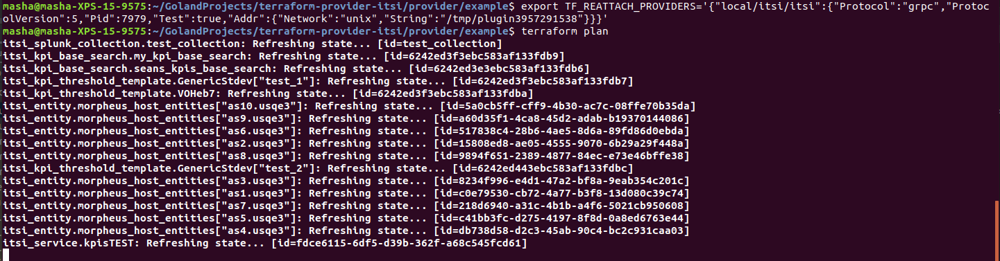
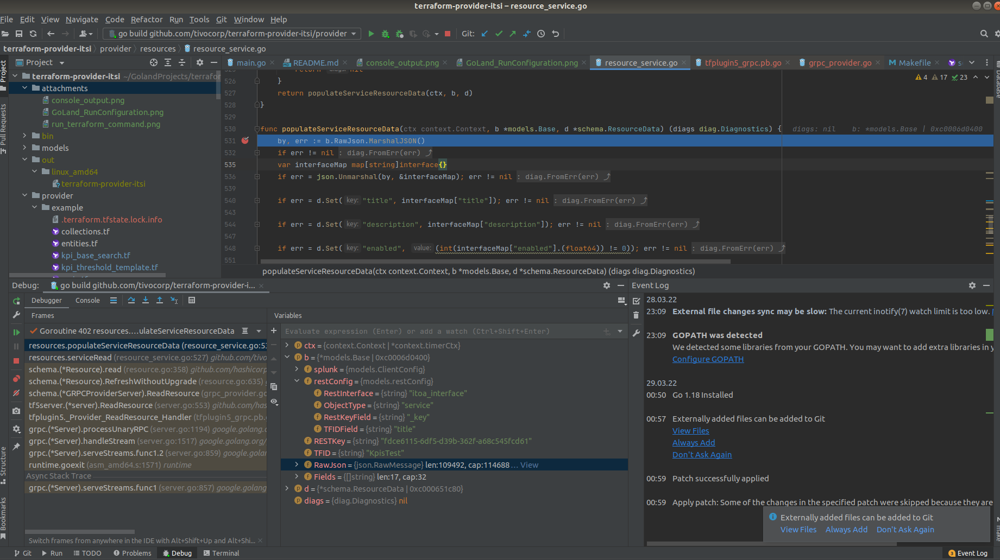

# terraform-provider-splunk-itsi

Terraform Provider for Splunk ITSI
- [Provider documentation](https://registry.terraform.io/providers/TiVo/splunk-itsi/latest/docs)
- [ITSI REST API](https://docs.splunk.com/Documentation/ITSI/4.4.1/RESTAPI/ITSIRESTAPIreference)

## Prerequisites
- install Terraform (v.1.0.4): https://learn.hashicorp.com/tutorials/terraform/install-cli
- golang version 1.17 installed
- goreleaser: https://goreleaser.com/install/

#### Starting a provider in Debug Mode: 
It is important to start a provider in debug mode only when you intend to debug it, as its behavior will change in minor ways from normal operation of providers. The main differences are:
- Terraform will not start the provider process; it must be run manually.
- The provider's constraints will no longer be checked as part of terraform init.
- The provider will no longer be restarted once per walk of the Terraform graph; instead the same provider process will be reused until the command is completed.

Prerequisites:
- install <a href="https://www.jetbrains.com/go/download/#section=linux">GoLand</a> & open terraform-provider-itsi project  

Steps:
- Pass debug flag, It can be done via the Run Configuration: 

- Make sure plugin is compiled in debug mode (`go build -gcflags="all=-N -l"`, GoLand takes care of this, executing via Debug button)
- After launching the plugin will output a message telling you to set the TF_REATTACH_PROVIDERS environment variable: 

- Copy and paste this to another shell, from which you will run Terraform: 

- Observe your caught breakpoint: 

###### Useful links:
- https://opencredo.com/blogs/running-a-terraform-provider-with-a-debugger/
- https://www.youtube.com/watch?v=hwXXgd96bgA
- https://www.terraform.io/plugin/sdkv2/debugging

